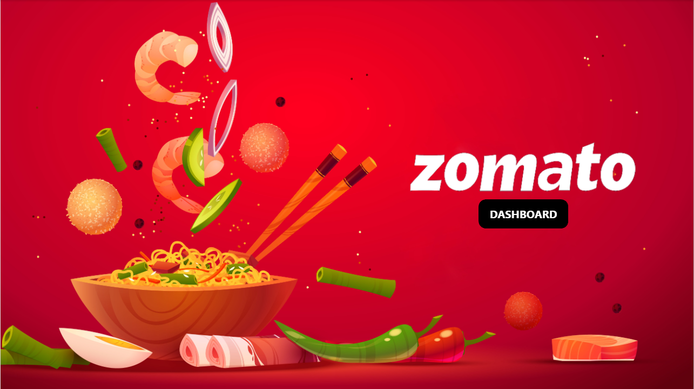
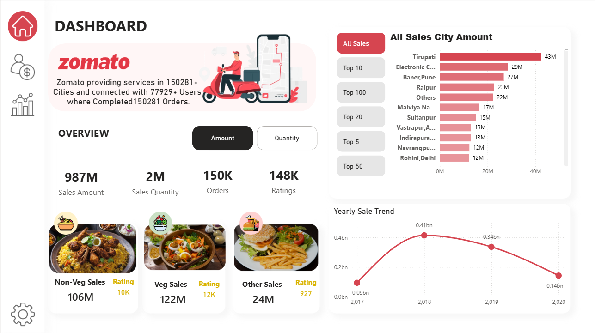
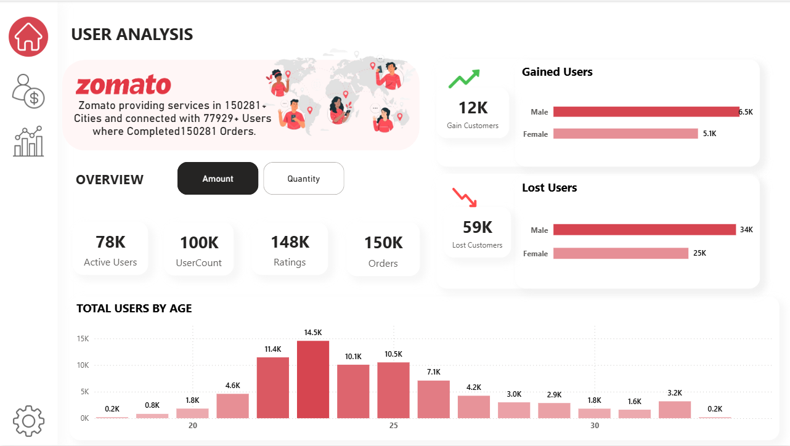
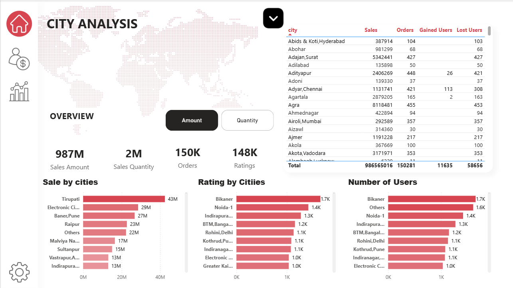
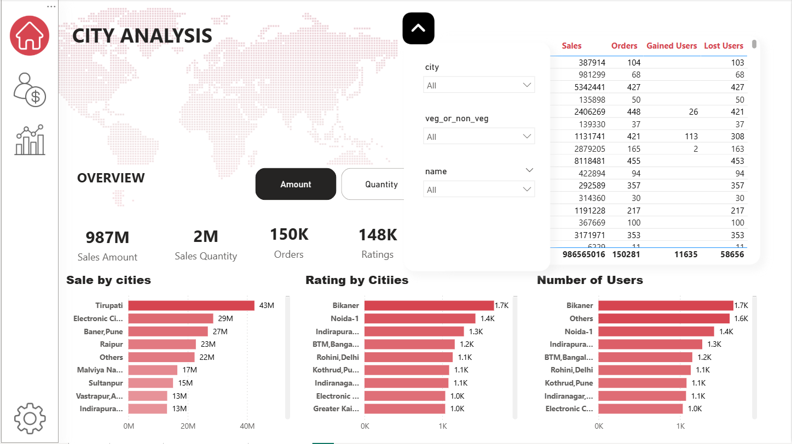
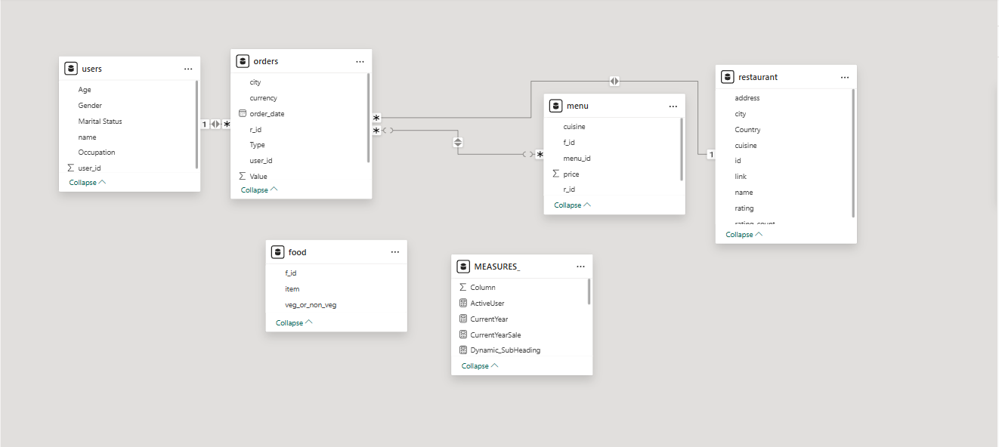
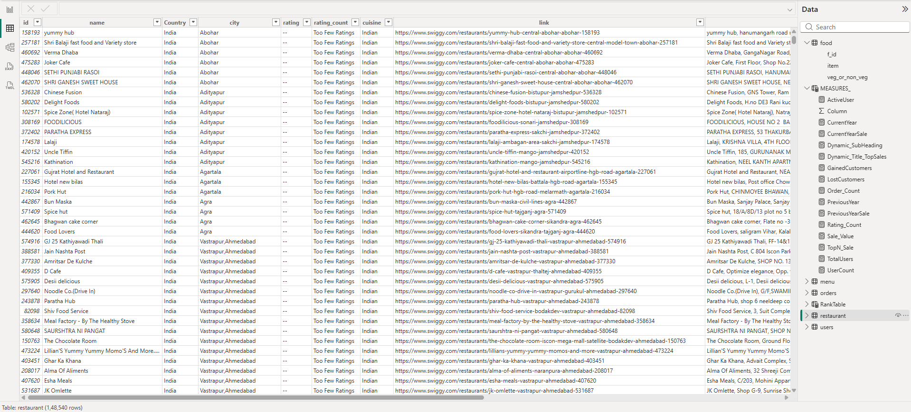

# 🍕 Zomato Analysis Dashboard — Power BI


> **A comprehensive multi-page Zomato food delivery analysis dashboard built in Power BI — covering sales performance, user behaviour, and city-level insights across 150,281+ orders and 148K+ ratings.**
> Built on a 5-table relational model with 1,48,540 restaurant records, dynamic Top-N filters, and category-level food analysis.

---

## 📸 Dashboard Preview

| Home / Landing Page | Main Dashboard |
|---|---|
|  |  |

| User Analysis | City Analysis |
|---|---|
|  |  |

| City Filters Panel | Data Model |
|---|---|
|  |  |

| Restaurant Table (1.48L rows) |
|---|
|  |

---

## 🚀 What Makes This Project Stand Out

- ✅ **3 dedicated pages** — Dashboard, User Analysis, City Analysis
- ✅ **1,48,540 restaurant records** — real-scale dataset from across India
- ✅ **5-table relational model** — users, orders, menu, food, restaurant + MEASURES
- ✅ **Dynamic Top-N city filter** — All Sales / Top 5 / Top 10 / Top 20 / Top 50 / Top 100
- ✅ **Amount vs Quantity toggle** — switches all visuals between value and volume view
- ✅ **Food category breakdown** — Non-Veg / Veg / Other with images, sales, and ratings
- ✅ **Yearly sale trend** — line chart 2017 → 2020 with peak at 0.41bn in 2018
- ✅ **User gain/loss analysis** — 12K gained vs 59K lost, broken by gender
- ✅ **Total users by age** — bar chart distribution across ages 20–35

---

## 📊 Dashboard Pages

### 🏠 Page 1 — Home (Landing Page)
- Full red background with Zomato branding
- Animated food illustration — noodle bowl with shrimp, chopsticks, chili
- **"zomato"** logo + **"DASHBOARD"** pill button
- Entry point to the main dashboard

### 📊 Page 2 — Main Dashboard
**Left navigation** (vertical icon panel): Home · User Analysis · City Analysis · Settings

**Info Banner** — Zomato brand card:
> *"Zomato providing services in 150281+ Cities and connected with 77929+ Users where Completed 150281 Orders."*

**Overview toggle** — Amount | Quantity

**Top KPI Cards:**
| Metric | Value |
|--------|-------|
| Sales Amount | 987M |
| Sales Quantity | 2M |
| Orders | 150K |
| Ratings | 148K |

**Food Category Cards** (with food photos):
| Category | Sales | Rating |
|----------|-------|--------|
| 🍗 Non-Veg Sales | 106M | 10K |
| 🥗 Veg Sales | 122M | 12K |
| 🍔 Other Sales | 24M | 927 |

**All Sales City Amount** (Right panel — Top N filter):
- Buttons: All Sales · Top 10 · Top 100 · Top 20 · Top 5 · Top 50
- Horizontal bar chart showing top cities:
  - Tirupati: **43M** (highest)
  - Electronic City: 29M
  - Baner, Pune: 27M
  - Raipur: 23M
  - Others: 22M
  - Malviya Nagar: 17M
  - Sultanpur: 15M

**Yearly Sale Trend** (Line chart):
| Year | Sales |
|------|-------|
| 2017 | 0.09bn |
| 2018 | 0.41bn (peak) |
| 2019 | 0.34bn |
| 2020 | 0.14bn |

### 👤 Page 3 — User Analysis
**KPI Cards:**
| Metric | Value |
|--------|-------|
| Active Users | 78K |
| UserCount | 100K |
| Ratings | 148K |
| Orders | 150K |

**Gained Users** — 12K total
- Male: 6.5K
- Female: 5.1K

**Lost Users** — 59K total
- Male: 34K
- Female: 25K

**Total Users by Age** (bar chart, ages 20–35):
- Peak at age 24: **14.5K**
- Age 23: 11.4K
- Age 25: 10.1K, Age 26: 10.5K
- Drops after 30: 3.0K → 2.9K → 1.8K

### 🏙️ Page 4 — City Analysis
**World map** (dotted pink) — geographic context

**City Data Table** (scrollable):
| Columns | |
|---------|--|
| City | Sales | Orders | Gained Users | Lost Users |
- Total: 986,565,016 Sales · 150,281 Orders · 11,635 Gained · 58,656 Lost

**Three bottom bar charts:**
1. **Sale by Cities** — Tirupati 43M (top), Electronic City 29M, Baner Pune 27M...
2. **Rating by Cities** — Bikaner 1.7K (top), Noida-1 1.4K, Indirapura 1.3K...
3. **Number of Users** — Bikaner 1.7K, Others 1.6K, Noida-1 1.4K...

**Filter panel** (slide-in via toggle button ▼/▲):
- **city** — dropdown (All)
- **veg_or_non_veg** — dropdown (All)
- **name** — dropdown (All)

---

## 🗃️ Data Model (5 Tables)

```
┌─────────────┐          ┌─────────────┐
│    users    │──1:*────▶│   orders    │
│  Age        │          │  city       │
│  Gender     │          │  currency   │
│  Marital    │          │  order_date │
│  name       │          │  r_id       │
│  Occupation │          │  Type       │
│  user_id    │          │  user_id    │
└─────────────┘          │  Value      │
                         └──────┬──────┘
                                │ *:*
                         ┌──────▼──────┐          ┌──────────────┐
                         │    menu     │──1:*─────▶│  restaurant  │
                         │  cuisine    │          │  address     │
                         │  f_id       │          │  city        │
                         │  menu_id    │          │  Country     │
                         │  price      │          │  cuisine     │
                         │  r_id       │          │  id          │
                         └──────┬──────┘          │  link        │
                                │                 │  name        │
                         ┌──────▼──────┐          │  rating      │
                         │    food     │          │  rating_count│
                         │  f_id       │          └──────────────┘
                         │  item       │
                         │  veg_or_non │
                         └─────────────┘

                         ┌──────────────┐
                         │  MEASURES_   │
                         │  ActiveUser  │
                         │  Column      │
                         │  CurrentYear │
                         │  CurrentYear │
                         │  Sale        │
                         │  Dynamic_Sub │
                         │  Heading     │
                         │  Title_TopSa │
                         │  Gained/Lost │
                         │  Customers   │
                         │  Order_Count │
                         │  Previous    │
                         │  Year/Sale   │
                         │  Rating_Count│
                         │  Sale_Value  │
                         │  TopN_Sale   │
                         │  TotalUsers  │
                         │  UserCount   │
                         └──────────────┘
```

| Table | Rows | Key Columns |
|-------|------|------------|
| `restaurant` | **1,48,540** | id, name, city, Country, cuisine, rating, rating_count, link, address |
| `orders` | 150K+ | order_date, r_id, f_id, user_id, city, currency, Type, Value |
| `users` | 100K | user_id, name, Age, Gender, Marital Status, Occupation |
| `menu` | — | menu_id, r_id, f_id, cuisine, price |
| `food` | — | f_id, item, veg_or_non_veg |
| `MEASURES_` | — | All DAX measures stored separately |

---

## ⚙️ Technical Implementation

### 🧮 Key DAX Measures

```dax
-- Total Sales Amount
Sale_Value = SUM(orders[Value])

-- Total Orders
Order_Count = COUNT(orders[r_id])

-- Active Users
ActiveUser = DISTINCTCOUNT(orders[user_id])

-- Total Users
UserCount = COUNT(users[user_id])

-- Gained Customers
GainedCustomers =
CALCULATE(
    COUNT(users[user_id]),
    users[Gained/Lost] = "Gained"
)

-- Lost Customers
LostCustomers =
CALCULATE(
    COUNT(users[user_id]),
    users[Gained/Lost] = "Lost"
)

-- Top N Sales (dynamic filter)
TopN_Sale =
VAR N = SELECTEDVALUE(RankTable[Rank])
RETURN
CALCULATE(
    [Sale_Value],
    TOPN(N, ALL(orders[city]), [Sale_Value], DESC)
)

-- Current Year Sale
CurrentYearSale =
CALCULATE([Sale_Value], YEAR(orders[order_date]) = [CurrentYear])

-- Previous Year Sale
PreviousYearSale =
CALCULATE([Sale_Value], YEAR(orders[order_date]) = [CurrentYear] - 1)

-- Dynamic Sub Heading
Dynamic_SubHeading =
"Zomato providing services in " &
FORMAT([Order_Count], "#,##0") & "+ Cities and connected with " &
FORMAT([UserCount], "#,##0") & "+ Users where Completed " &
FORMAT([Order_Count], "#,##0") & " Orders."

-- Rating Count
Rating_Count = SUM(restaurant[rating_count])
```

### 🎨 Design & Theme
- **Home page**: Bold red background (#E23744 Zomato red), food photography
- **Dashboard pages**: Clean white/light grey background
- **Accent color**: Zomato red (#E23744) for bars, highlights, KPI values
- **Navigation**: Left vertical icon panel — Home, User, City, Settings
- **Typography**: Bold section titles, red accent for key numbers
- **Food category cards**: Real food photography with category icons
- **Charts**: Horizontal bar charts (red gradient), smooth red line chart

### 🔄 Interactive Features
1. **Amount / Quantity toggle** — switches all metrics between value and volume
2. **Top N filter panel** — All / Top 5 / 10 / 20 / 50 / 100 cities
3. **City filter panel** — slide-in drawer with city, veg_or_non_veg, name dropdowns
4. **Navigation icons** — switch between Dashboard, User Analysis, City Analysis
5. **Scroll table** — city-wise detailed data with all 4 metrics
6. **Yearly trend line** — shows rise and fall from 2017 to 2020

---

## 🛠️ How to Use This Project

### Download & Explore
1. Download `ZOMATO_DASHBOARD.pbix`
2. Open in **Power BI Desktop**
3. Navigate using the left icon panel: Home → User Analysis → City Analysis
4. Use **Amount | Quantity** toggle to switch all visuals
5. Use **Top N buttons** to filter city chart (All / Top 5 / 10 / 20 / 50 / 100)
6. Click ▼ arrow on City Analysis to open the filter dropdown panel

### Data Scale
- **1,48,540 restaurant records** — across India (Abohar to Vastrapur, Ahmedabad)
- **150,281 orders** — completed deliveries
- **100K users** — 78K active, 12K newly gained, 59K churned
- **148K ratings** — across all restaurants
- **987M total sales value**

---

## 📌 Skills Demonstrated

| Skill | Application |
|-------|-------------|
| **Multi-table Data Modelling** | 5-table star schema with many-to-many relationships |
| **Large Dataset Handling** | 1,48,540 rows in restaurant table |
| **Dynamic Top-N Filtering** | RankTable + TOPN DAX for city filter |
| **DAX Measures** | 15+ measures — sales, users, gained/lost, dynamic headings |
| **Multi-page Navigation** | 4 pages with icon-based navigation |
| **Food Category Analysis** | Veg/Non-Veg/Other breakdown with images |
| **User Churn Analysis** | Gained vs Lost customers by gender |
| **Time Intelligence** | Year-wise trend 2017–2020 |
| **UX Design** | Red theme matching Zomato brand, food photography |

---

## 🏙️ Top Cities by Sales

| Rank | City | Sales |
|------|------|-------|
| 1 | Tirupati | 43M |
| 2 | Electronic City | 29M |
| 3 | Baner, Pune | 27M |
| 4 | Raipur | 23M |
| 5 | Others | 22M |
| 6 | Malviya Nagar | 17M |
| 7 | Sultanpur | 15M |
| 8 | Vastrapur, A... | 13M |
| 9 | Indirapura... | 13M |
| 10 | Navrangpu... | 12M |

---

## 🔧 Requirements

| Tool | Notes |
|------|-------|
| Power BI Desktop | Free download from Microsoft |
| No API needed | Uses structured CSV/Excel dataset |

---

## 👨‍💻 Author

**Saketh Suman Bathini**
Data Analyst · AI Engineer · Full-Stack Developer · Hyderabad, India

[](https://www.linkedin.com/in/saketh-suman/)
[](https://github.com/SakethSumanBathini)
[](mailto:sakethsumanbathini@gmail.com)

---

## 📄 License

This project is open source and available under the [MIT License](LICENSE).

---

> ⭐ **If this project helped you, please give it a star!**
